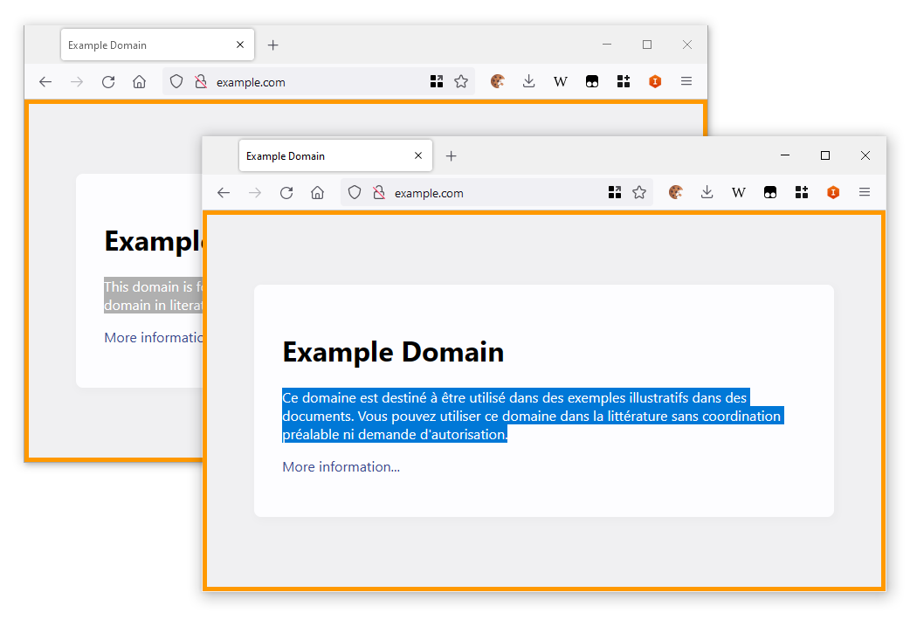
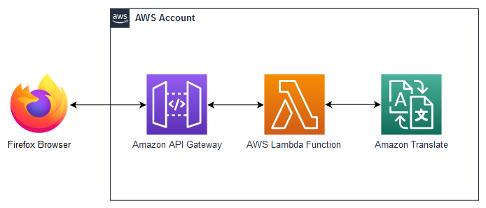
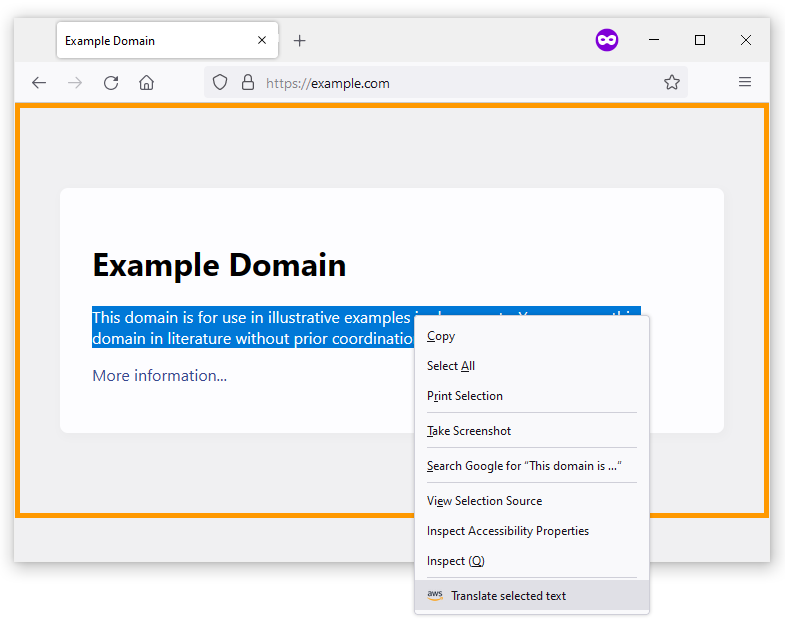

# Browser Extension powered by Amazon API Gateway

This sample code allows you to quickly deploy a Firefox Extension that uses Serverless AWS Services as a backend. This example allows users to translate selected text on a loaded webpage. 

The extension sends requests to an API Gateway which forwards them to a Lambda Function. The Lambda Function then translates the text using Amazon Translate and returns it to the user's browser to be displayed on screen. 

## Architecture

Requests are started in the Browser Extension. They then go through API Gateway to a Lambda Function. The Lambda function will submit the text for translation to Amazon Translate and will return the translated text back to the Browser through API Gateway. 

## Deployment

Clone this repository or download it as a .ZIP file

### Backend

1. In your AWS account, in CloudFormation, create a new stack and use the template file `/aws_resources/template.yml`
2. When the stack is deployed, go to Outputs and make note of `translateURL`

### Frontend (Firefox Extension)

1. In the extension's background script, `extension\background_script.js`, replace the API Gateway URL on line 18. 
2. In your Firefox Browser, navigate to `about:debugging`
3. On the side-bar on the left, select "This Firefox"
4. Click on Load "Temporary Add-on..."
5. Navigate to the directory where this repository was cloned, then select the file `extension/manifest.json`

## Usage

Once the extension is loaded you should see an Orange border around any open webpages. This is a sign that the Extension was correctly loaded.

From any webpage (e.g. http://www.example.com/) highlight some text then right click on it and select "Translate selected text"

The text should then be switched with its French equivalent.

## Customization

To change the translation language, edit lines 66 and 67 in the file `extension\background_script.js` and change the source and destination language codes as needed.

To remove the orange border around the page content, edit the file `extension\content_script.js` and delete the last line. 

## Security

See [CONTRIBUTING](CONTRIBUTING.md#security-issue-notifications) for more information.

## License

This library is licensed under the MIT-0 License. See the LICENSE file.

